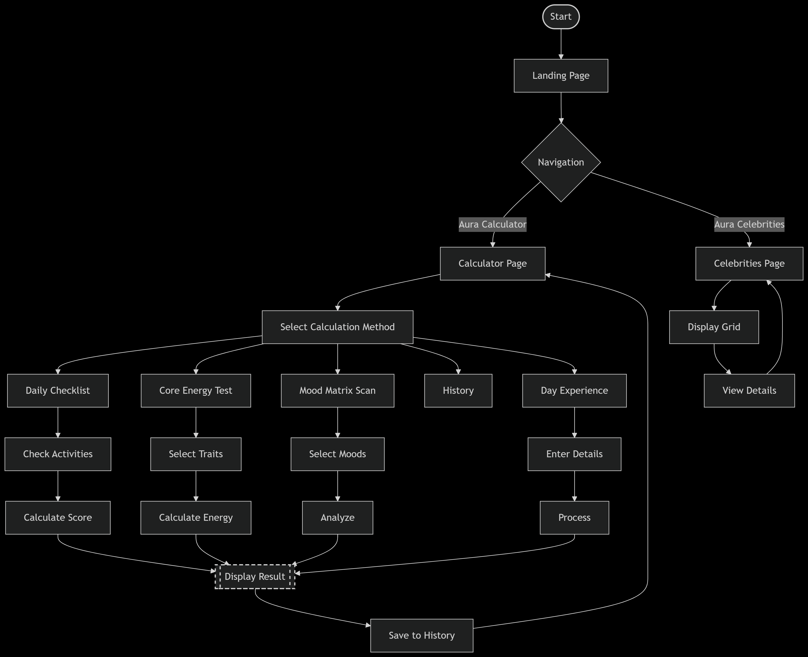

# Aura Checker 🎯

## Basic Details
### Team Name: Aura.js

### Team Members
- Team Lead: Ganga Anilkumar - Government Engineering College, Idukki
- Member 2:  Ajith Joy - Government Engineering College, Idukki

### Project Description

AuraCheck is a web app that analyzes user's emotional and energetic states through interactive quizzes, providing personalized aura scores and insights. It also features a gallery of famous aura influencers for inspiration.

### The Problem 
It solves the urgent problem of not knowing if your aura is glowing or just buffering, while tracking how many auras you’ve lost or gained and showing your current vibe status.

### The Solution
"AuraChekmakes self-care fun with a game-like mood tracker. Earn points for positive actions (+50 for kindness) and lose points for stress (-30), unlocking playful aura personas like 'Sunbeam Superstar'. Get personalized tips to boost your energy through a colorful, rewarding interface that turns emotional growth into an adventure."

## Technical Details
### Technologies/Components Used
For Software:
  HTML5 (Structure)
  CSS3 (Styling with animations and gradients)
  JavaScript (Logic, interactivity)
  
- GitHub/Git
  VS Code
  Chrome DevTools 

### Implementation
  Installation
  Clone the repo:
  https://github.com/A-jith-u/useless_project_Aura

# Run
open index.html  # macOS
start index.html # Windows

### Project Documentation
For Software:

# Screenshots 

# Diagrams

### Project Demo
# Video
[[video_screenrecord.mp4](https://drive.google.com/file/d/1vf5flN9fXtZEC5o7VyhDKIJAUUaGFIun/view?usp=drive_link)]]
Detailed workflow of the project

# Additional Demos
[ https://a-jith-u.github.io/useless_project_Aura/ ](https://a-jith-u.github.io/useless_project_Aura/ )

## Team Contributions
- Ajith Joy: Frontend development
- Ganga Anilkumar: Assisted in frontend development

---
Made with ❤️ at TinkerHub Useless Projects 

